# Instalación de Nginx en Ubuntu


## 1. Introducción.
Nginx es un servidor Web/proxy de alto rendimiento, es un software de código abierto y multiplataforma. Es un servidor web de los mas usados en la actualizada superando a Apache, esto es debido a la capacidad de rendimiento que tiene Nginx al recibir una gran cantidad de peticiones y la buena gestión de la RAM del sistema.  

Existe una versión de pago denominada Nginx Plus que ofrece muchas funcionalidades adiciones.

En esta practica vamos a ver la instalación del sistema Nginx un servidor Ubuntu 20.04 y a continuación veremos su configurado junto a la creación de un dominio para alojar nuestras paginas web.

## 2. Instalación.

Primero, antes de proceder a instalar Nginx es recomendable que se actualicen tanto los paquete como el sistema, por que debemos usar los siguiente comandos.
```
sudo apt upgrade && sudo apt update
```

Nginx esta en los repositorios de Ubuntu así que podemos hacer uso del sistema de paquetes apt para instalarlo.
```
sudo apt install nginx
```

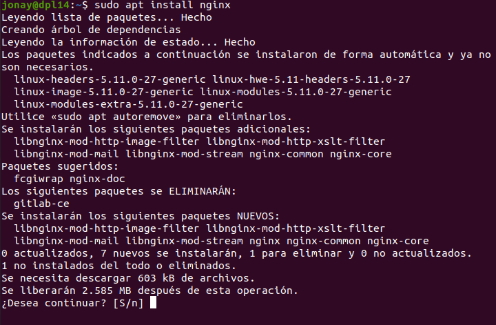


Con esto finalizado, la instalación como tal estaría realizada, pero vamos a realizar una serie de pasos que son necesarios para que el sistema Nginx este funcionando.

Antes de probar el Nginx vamos a permitir el acceso acceso de Ngninx a través del cortafuego. Con el siguiente comando vamos a ver la lista de aplicaciones.
```
sudo ufw app list
```

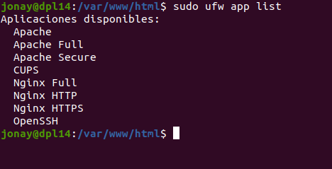


Con este comando veremos tres lineas de Nginx:
- Nginx Full: abre el puerto 80 y el puerto 443
- Nginx HTTP: abre el puerto 80
- Nginx HTTPS: abre el puerto 80 y el 443

En este caso vamos a abrir solo el puerto 80.
```
sudo ufw allow 'Nginx HTTP'
```

Para comprobar la nueva regla usamos:
```
sudo ufw status
```

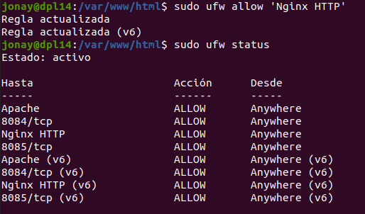


Y para terminar con la instalación vamos a comprobar el servicio Nginx.
```
systemctl status nginx
```

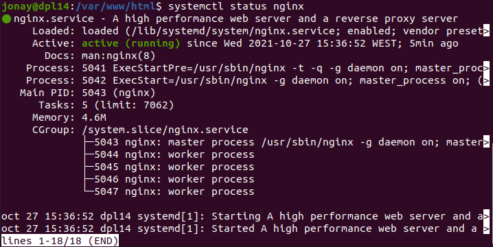


En caso de que esta paso nos de error debemos comprobar si tenemos un conflicto de puerto con otro servicio y repararlo.

Y para acceder a Nginx vamos un navegador un ponemos la IP del servidor o nombre de este.

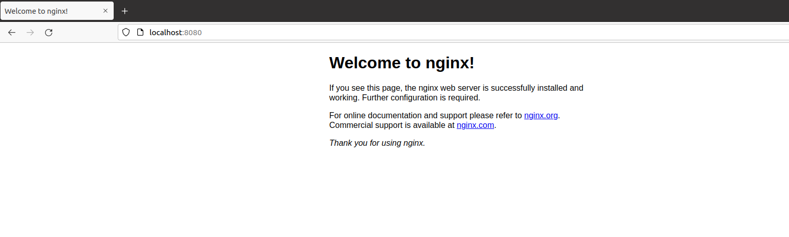


## 3. Configurar un dominio.
Vamos a configurar un nuevo dominio que en Nginx se denomina “bloques de servidor”, algo parecido a “hosts” en Apache. Vamos a crear un dominio con el nombre “your_domain”.

Lo primero que vamos a realizar es añadir el nombre del dominio en el fichero hosts del sistema de la siguiente manera.

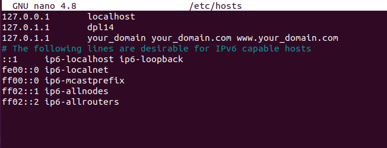


Ahora vamos a crear una nueva estructura de directorios en “/var/www” y dejaremos “/var/www/html” para otras peticiones que no sean de nuestro dominio o de otros dominios existentes.
Creamos la carpeta.
```
sudo mkdir -p /var/www/your_domain/html
```


Cambiamos el propietario y grupo root por el usuario del sistema.
```
sudo chown -R $USER:$USER /var/www/your_domain/html
```


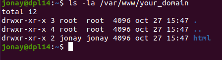


Le añadimos permisos al propietario, grupo y otros.
```
sudo chmod -R 755 /var/www/your_domain
```

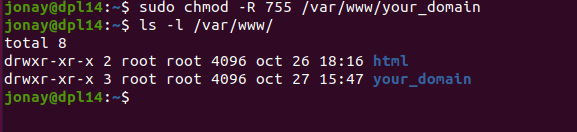


Ahora nos movemos a “html” que hemos creado y creamos una página index.html.
```
nano /var/www/your_domain/html/index.html
```

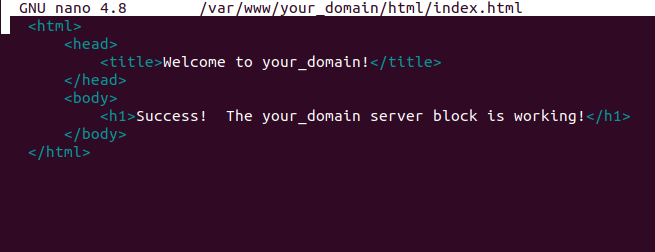


Para que Nginx pueda reconocer el contenido, tenemos que crear un bloque de servidor. Crearemos uno nuevo en “/etc/nginx/sites-available/your_domain”. Cambiar el puerto en caso de no estar disponible.
```
sudo nano /etc/nginx/sites-available/your_domain
```

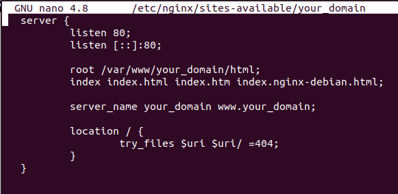


Ahora vamos a crear un enlace simbólico de “/etc/sites-available/your_domain” a “/etc/nginx/sites-enable/”, esto activara nuestro dominio para que Nginx lo procese.
```
sudo ln -s /etc/nginx/sites-available/your_domain /etc/nginx/sites-enabled/
```

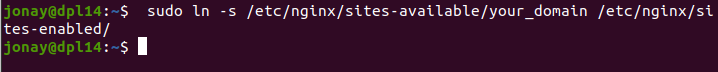


El siguiente paso es modificar “nginx.conf”, vamos a modificar descomentar la linea “server_names_hash_bucket_size“ para evitar problemas de memoria de deposito de hash con el nombre del servidor.
Buscamos la linea en el archivo y le quitamos el  símbolo “#”.
```
sudo nano /etc/nginx/nginx.conf
```

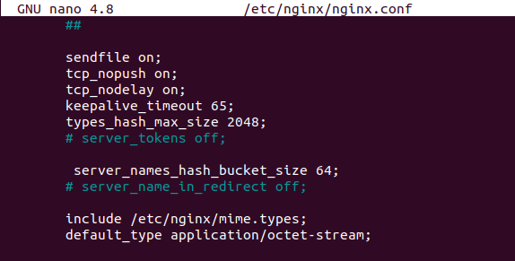


Ahora vamos a comprobar si hemos tenido algún error de sintaxis en alguno de los archivos.
```
sudo nginx -t
```

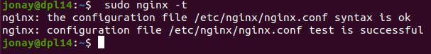


Si no hemos tenido problemas podemos reiniciar el servicio para aplicar los cambios que hemos realizado.

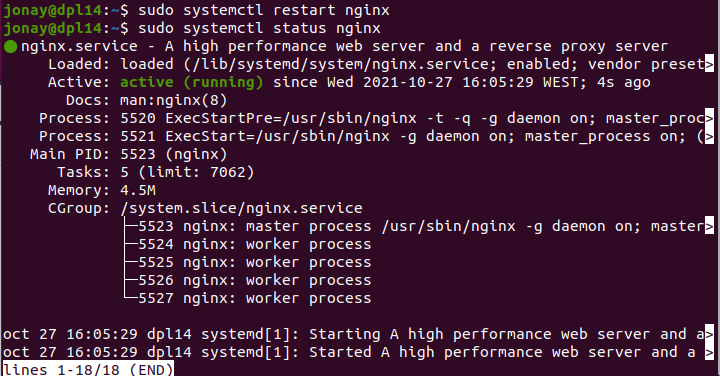


Y ya deberíamos poder acceder a nuestro dominio con su nombre en un navegador.

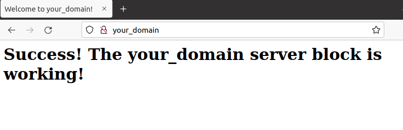
